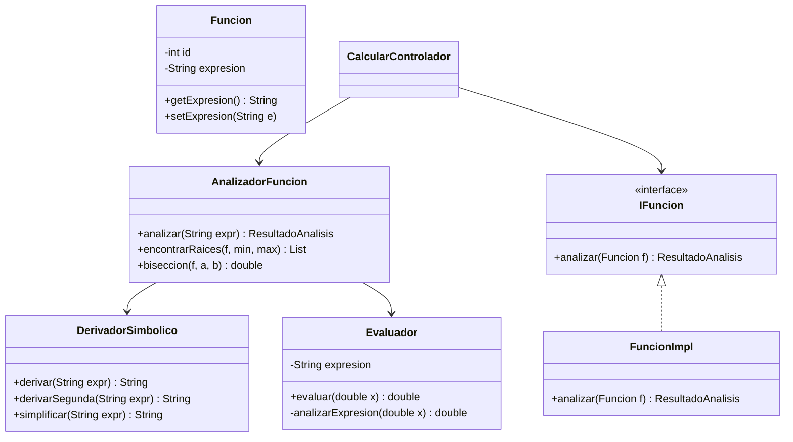
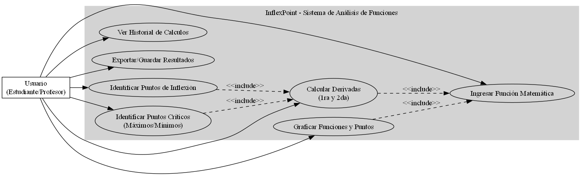
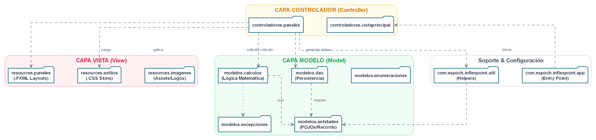
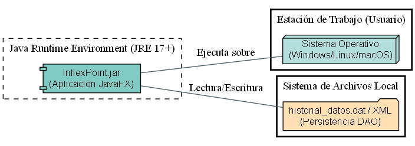

# MANUAL TÉCNICO: SISTEMA INFLEXPOINT

## ÍNDICE
1. [Portada](#1-portada)
2. [Introducción](#2-introducción)
3. [Planteamiento del Problema](#3-planteamiento-del-problema)
4. [Acta de Constitución (Project Charter)](#4-acta-de-constitución-project-charter)
5. [Gestión de Proyecto (SCRUM & PMBOK)](#5-gestión-de-proyecto-scrum--pmbok)
6. [Alcance y Requerimientos (SRS)](#6-alcance-y-requerimientos-srs--ieee-830)
7. [Historias de Usuario](#7-historias-de-usuario-scrum)
8. [Arquitectura del Sistema](#8-arquitectura-del-sistema)
9. [Diseño del Sistema (UML)](#9-diseño-del-sistema-uml)
10. [Implementación Técnica Detallada](#10-implementación-técnica-detallada)
11. [Calidad de interfaces (UI/UX)](#11-calidad-de-interfaces-uiux)
12. [Gestión de Pruebas (QA)](#12-gestión-de-pruebas-quality-assurance)
13. [Despliegue y Mantenimiento](#13-despliegue-y-mantenimiento)
14. [Gestión de Riesgos](#14-gestión-de-riesgos-pmbok)
15. [Guía de Instalación y Usuario](#15-guía-de-instalación-y-usuario)
16. [Interpretación de Resultados](#16-interpretación-de-resultados)
17. [Conclusiones y Lecciones Aprendidas](#17-conclusiones-y-lecciones-aprendidas)

---

## 1. Portada

**INSTITUCIÓN:** Escuela Superior Politécnica de Chimborazo (ESPOCH)  
**FACULTAD:** Facultad de Informática y Electrónica (FIE)  
**CARRERA:** Tecnologías de la Información  
**ASIGNATURA:** Programación Orientada a Objetos  
**SISTEMA:** "InflexPoint" - Plataforma de Cálculo y Análisis Funcional  
**PERIODO ACADÉMICO:** PAO 2 (Ciclo 1 y 2)  
**VERSIÓN:** 2.1.0 
**FECHA DE ENTREGA:** 20 de enero de 2026  

**EQUIPO DE DESARROLLO (SCRUM TEAM):**
*   **Product Owner:** Facultad de Informática y Electrónica (ESPOCH)
*   **Scrum Master:** Juan Moreno (Fullstack & Integration Specialist)
*   **Equipo de Desarrollo:**
    *   Karla Calvopiña (Backend Architect & Mathematical Core)
    *   Glenda Alvarado (Lead UI/UX Designer)
    *   Jojanci Gómez (Backend Logic & Algorithm Developer)
    *   Andrea Quiroga (Quality Assurance & Documentation Lead)

---

## 2. Introducción

### 2.1 Propósito del manual
El presente Manual Técnico constituye el repositorio documental definitivo de la arquitectura, diseño y lógica de implementación del sistema **InflexPoint**. Su objetivo es proporcionar una visión exhaustiva y técnica a nivel de ingeniería de software para asegurar la mantenibilidad, escalabilidad y auditabilidad académica del proyecto.

### 2.2 Alcance del documento
Este documento integra las metodologías **SCRUM** para la gestión ágil y las directrices de **PMBOK** para la visión de gestión de proyectos, alineándose estrictamente con los estándares **IEEE 830 (SRS)** para la definición de requerimientos. El alcance comprende desde el *Project Charter* hasta el despliegue final en entornos de producción.

### 2.3 Público objetivo
Dirigido a la comisión académica evaluadora de la ESPOCH, desarrolladores que busquen extender el motor matemático, y arquitectos de software interesados en aplicaciones de cálculo simbólico bajo JavaFX.


---

## 3. Planteamiento del Problema
El aprendizaje del cálculo diferencial e integral es un pilar fundamental en las carreras de ingeniería de la ESPOCH. Sin embargo, los estudiantes suelen enfrentar dificultades en:
1.  **Error humano en procesos mecánicos:** La derivación de funciones complejas (trigonométricas, exponenciales, compuestas) es susceptible a errores algebraicos menores que invalidan el análisis completo.
2.  **Falta de validación interactiva:** La carencia de herramientas que permitan contrastar los resultados analíticos con representaciones gráficas y numéricas en tiempo real limita la comprensión intuitiva de conceptos como puntos críticos y concavidad.
3.  **Necesidad de precisión simbólica:** Muchas herramientas existentes son puramente numéricas, lo que impide al estudiante ver la estructura algebraica de la derivada resultante ($f'(x)$), esencial para el aprendizaje académico.

**InflexPoint** nace como respuesta a esta problemática, proporcionando un motor de cálculo simbólico confiable y una interfaz visual que garantiza la precisión en el análisis funcional.

---

## 4. Acta de Constitución del Proyecto (Project Charter)

### 4.1 Objetivo General
Diseñar e implementar un ecosistema de software multiplataforma para el análisis analítico, gráfico y numérico de funciones matemáticas de variable real, garantizando la precisión simbólica y la interactividad visual para el entorno académico.

### 4.2 Objetivos Específicos
*   **Análisis:** Analizar y validar expresiones matemáticas de variable real mediante el procesamiento de árboles sintácticos para garantizar la integridad de los datos de entrada.
*   **Diseño:** Diseñar una arquitectura robusta bajo los patrones MVC y DAO, asegurando el desacoplamiento entre el motor matemático, la persistencia y la interfaz de usuario.
*   **Implementación:** Implementar un motor de derivación simbólica recursiva y algoritmos de búsqueda de raíces para la localización precisa de puntos críticos y de inflexión.
*   **Verificación:** Validar la precisión y robustez del sistema mediante un plan de pruebas exhaustivo que incluya validaciones analíticas y de estrés matemático.

### 4.3 Justificación
La enseñanza del cálculo requiere herramientas que trasciendan la simple resolución numérica. InflexPoint se justifica como una herramienta pedagógica que expone la estructura simbólica de las derivadas y localiza puntos críticos (máximos, mínimos e inflexión) con rigor analítico, eliminando el error humano en cálculos complejos y permitiendo la validación inmediata de hipótesis matemáticas.

### 4.4 Stakeholders
*   **Internos:** Equipo de desarrollo (Developers, QA, SM).
*   **Externos:** Docentes de la FIE, Estudiantes de Ingeniería en Software, Autoridades de la ESPOCH.

### 4.5 Restricciones y Supuestos
*   **Restricción:** Lenguaje de desarrollo Java 17+, Framework UI JavaFX.
*   **Supuesto:** El usuario posee conocimientos básicos de sintaxis matemática estándar.
*   **Restricción Técnica:** No se requiere conexión a internet para el funcionamiento core.

---

## 5. Gestión de Proyecto (SCRUM & PMBOK)

### 5.1 Metodología de Desarrollo: SCRUM
Se adoptó **SCRUM** debido a que permite un desarrollo iterativo e incremental, esencial en software donde la lógica matemática debe validarse paso a paso.

### 5.2 Estructura de Desglose del Trabajo (EDT / WBS)
| Nivel 1 | Nivel 2 (Entregables) | Nivel 3 (Paquetes de Trabajo) |
| :--- | :--- | :--- |
| **1. InflexPoint** | 1.1 Gestión | 1.1.1 Project Charter, 1.1.2 Requerimientos SRS |
| | 1.2 Diseño | 1.2.1 Diagramas UML, 1.2.2 Diseño UI/UX |
| | 1.3 Desarrollo | 1.3.1 Motor Matemático, 1.3.2 Capa DAO, 1.3.3 Controller FXML |
| | 1.4 Calidad | 1.4.1 Pruebas Unitarias, 1.4.2 Manual Técnico |
| | 1.5 Cierre | 1.5.1 Empaquetado JAR, 1.5.2 Presentación |

### 5.3 Matriz de Asignación de Responsabilidades (RACI)
**Roles:** SM (Juan Moreno), BE (Karla Calvopiña), UI (Glenda Alvarado), LOG (Jojanci Gómez), QA (Andrea Quiroga).
| Tarea / Entregable | Moreno | Calvopiña | Alvarado | Gómez | Quiroga |
| :--- | :---: | :---: | :---: | :---: | :---: |
| Project Charter | **R** | A | I | I | C |
| Diseño de Arquitectura | A | **R** | C | **R** | I |
| Motor de Derivación | I | **R** | I | **R** | C |
| Interfaz (CSS/FXML) | C | I | **R** | I | A |
| Plan de Pruebas | A | C | I | C | **R** |
| Documentación Final | **R** | C | C | C | **R** |
*(R: Responsible, A: Accountable, C: Consulted, I: Informed)*

### 5.4 Planificación Temporal (Gantt Simplificado)
| Fase / Sprint | Duración | Actividad Principal | Hito |
| :--- | :--- | :--- | :--- |
| **Sprint 1** | 2 sem | Requerimientos y Motor Core | Motor de Derivación funcional |
| **Sprint 2** | 2 sem | Interfaz de Usuario y Gráfica | GUI integrada con lógica |
| **Sprint 3** | 1 sem | Persistencia DAO e Historial | Sistema completo con historial |
| **QA/Mantenimiento** | 1 sem | Pruebas de borde y Documentación | Entregable Final PAO 2 |

---

## 6. Alcance y Requerimientos (SRS – IEEE 830)

### 6.1 Especificación Funcional (RF)
| ID | Nombre | Descripción Técnica | Trazabilidad (CU) |
| :--- | :--- | :--- | :--- |
| **RF-01** | **Parsing Matemático** | Interpretación de cadenas de texto en estructuras de datos. | CU-01 |
| **RF-02** | **Derivación Simbólica** | Aplicación de reglas de diferenciación ($f'(x)$, $f''(x)$). | CU-02 |
| **RF-03** | **Evaluación Numérica** | Cálculo del valor en puntos específicos. | CU-03 |
| **RF-04** | **Análisis de Extremos** | Localización de raíces de la derivada para máximos/mínimos. | CU-03 |
| **RF-05** | **Detección de Concavidad** | Análisis de la segunda derivada. | CU-03 |
| **RF-06** | **Graficación Visual** | Renderizado vectorial en tiempo real. | CU-03 |
| **RF-07** | **Persistencia DAO** | Gestión del historial de funciones. | CU-04 |

### 6.2 Especificación No Funcional (RNF)
*   **RNF-01 [Eficiencia]:** Los cálculos deben ejecutarse en < 500ms.
*   **RNF-02 [Robustez]:** Manejo de excepciones matemáticas.
*   **RNF-03 [Usabilidad]:** Interfaz responsiva y amigable.

---

## 7. Historias de Usuario (SCRUM)

| ID | Título | Prioridad | Criterios de Aceptación | Sprint |
| :--- | :--- | :--- | :--- | :--- |
| **HU-01** | **Análisis Simbólico** | Crítica | Como usuario quiero ver la función derivada para validar mis procesos analíticos. | 1 |
| **HU-02** | **Gráfico Interactivo** | Alta | Como usuario quiero visualizar la curva para entender el comportamiento global de la función. | 1 |
| **HU-03** | **Localización Crítica** | Alta | Como usuario quiero que el sistema marque los máximos y mínimos para no buscarlos manualmente. | 2 |
| **HU-04** | **Gestión Histórica** | Media | Como usuario quiero recuperar funciones analizadas previamente para ahorrar tiempo. | 2 |

---

## 8. Arquitectura del Sistema

### 8.1 Patrón Arquitectónico Real: MVC + DAO
InflexPoint implementa una arquitectura por capas para garantizar el desacoplamiento:

1.  **Capa de Presentación (Vista):** Definida en FXML y controlada mediante estilos CSS. Posee nula lógica de negocio.
2.  **Capa de Control (Controlador):** Actúa como mediador. El `CalcularControlador` recibe las entradas, coordina con el `AnalizadorFuncion` y entrega el resultado a la vista.
3.  **Capa de Dominio (Modelo):** Contiene la lógica matemática (`DerivadorSimbolico`, `Evaluador`). Es el núcleo intelectual del sistema.
4.  **Capa de Persistencia (DAO):** Abstrae el almacenamiento del historial de funciones. Implementa el patrón *Data Access Object* para permitir futuras migraciones a bases de datos SQL/NoSQL sin alterar la lógica de negocio.

### 8.2 Diagrama de Responsabilidades
*   **Frontend:** `VistaPrincipalControlador`, `CalcularControlador`.
*   **Motor Matemático:** `AnalizadorFuncion`, `DerivadorSimbolico`, `ValidadorExpresion`.
*   **Infraestructura:** `FuncionImpl` (DAO), `GestorHistorial`.

---

## 9. Diseño del Sistema (UML)

### 9.1 Diagrama de Clases (Arquitectura Core)


#### Detalle de Clases Principales
| Clase | Atributos Relevantes | Métodos Clave |
| :--- | :--- | :--- |
| **AnalizadorFuncion** | `minX`, `maxX`, `step` | `analizar()`, `encontrarRaices()`, `clasificarPuntosCriticos()` |
| **DerivadorSimbolico**| *N/A (Stateless Engine)* | `derivar()`, `simplificar()`, `toLaTeX()` |
| **Evaluador** | `expresion`, `posicion` | `evaluar()`, `analizarFactor()`, `normalizar()` |
| **Funcion** | `idFuncion`, `expresion` | `getExpresion()`, `setExpresion()`, `getTipo()` |
| **ResultadoAnalisis** | `derivada1`, `puntosCriticos` | `getDerivada1()`, `getPuntosInflexion()` |

### 9.2 Diagrama de Casos de Uso


#### Descripción de Flujos de Casos de Uso
| Caso de Uso | Actores | Flujo Principal (Éxito) | Flujo Alterno (Error) |
| :--- | :--- | :--- | :--- |
| **CU-01: Ingresar Función** | Usuario | 1. Usuario digita la expresión.<br>2. Sistema valida sintaxis.<br>3. Se habilita el botón calcular. | El sistema muestra alerta de "Expresión Inválida" si el formato es erróneo. |
| **CU-02: Visualizar Derivadas** | Usuario | 1. Al calcular, el sistema muestra $f'(x)$ y $f''(x)$ simplificadas. | Si la función no es derivable, se informa al usuario. |
| **CU-03: Ver Análisis Gráfico** | Usuario | 1. El sistema renderiza la curva.<br>2. Se marcan puntos críticos y de inflexión. | Si los valores están fuera de rango, el gráfico se ajusta automáticamente. |
| **CU-04: Gestionar Historial** | Usuario | 1. Cada cálculo se guarda vía DAO.<br>2. El usuario consulta la lista. | Si no hay datos, se muestra una lista vacía con mensaje informativo. |

### 9.3 Diagrama de Paquetes


---

## 10. Implementación Técnica Detallada

### 10.1 Motor de Derivado Simbólico
La implementación utiliza un algoritmo de **procesamiento recursivo de árboles sintácticos**. Cada operador (+, -, *, /, ^) es tratado como una regla de derivación específica:
*   **Regla de la Cadena:** Aplicada recursivamente para funciones compuestas como `sin(x^2)`.
*   **Simplificación:** Un motor post-derivación elimina términos redundantes (ej: `0*x` o `1*f(x)`).

### 10.2 Capa DAO (Data Access Object)
Se implementó `IFuncion` como contrato de interfaz para desacoplar el origen de datos. Actualmente, `FuncionImpl` utiliza una estructura de persistencia en memoria/serialización para el historial del PAO 2, permitiendo que la transición a una base de datos real sea transparente para los controladores.

---


---

## 11. Calidad de interfaces (UI/UX)
InflexPoint prioriza la **usabilidad académica** mediante:
*   **Diseño Coherente:** Uso de una paleta de colores profesional (Calypso) que reduce la fatiga visual.
*   **Navegación Clara:** Menú lateral intuitivo para alternar entre módulos.
*   **Accesibilidad:** Mensajes descriptivos en los puntos críticos y herramientas de teclado virtual para ingreso de fórmulas.
*   **Consistencia Visual:** Alineación de componentes JavaFX siguiendo guías de diseño moderno.

---

## 12. Gestión de Pruebas (Quality Assurance)

### 12.1 Estrategia de Testing
Se aplicaron pruebas de **Caja Blanca** para la lógica de derivación y pruebas de **Caja Negra** para la validación de requerimientos de usuario.

### 12.2 Casos de Prueba Reales
| Caso | Función Entrada | Resultado Esperado ($f'(x)$) | Estado |
| :--- | :--- | :--- | :--- |
| **TC-01** | `x^3 - 5x` | `3x^2 - 5` | Exitoso |
| **TC-02** | `sin(x)` | `cos(x)` | Exitoso |
| **TC-03** | `exp(x)` | `exp(x)` | Exitoso |
| **TC-04** | `1/x` | `-1/(x^2)` | Exitoso |

---

## 13. Despliegue y Mantenimiento

### 13.1 Diagrama de Despliegue


### 13.2 Requisitos Técnicos
*   **Procesador:** > 1.5 GHz.
*   **RAM:** Mínimo 4 GB.
*   **Software:** Java Runtime Environment (JRE) 17 o superior instalado y configurado en el PATH.

---

## 14. Gestión de Riesgos (PMBOK)

### 14.1 Matriz de Riesgos
| Riesgo | Probabilidad | Impacto | Plan de Respuesta |
| :--- | :---: | :---: | :--- |
| **Ambigüedad en parsing** | Media | Alto | Implementación de `ValidadorExpresion` con regex estrictos. |
| **Desempeño en gráficas** | Baja | Medio | Uso de rendering en `Canvas` para optimizar FPS. |
| **Errores de precisión** | Media | Alto | Uso de bisección con tolerancia $10^{-7}$ y tipo `double`. |
| **Incumplimiento de Sprints** | Baja | Alto | Reuniones Daily para detectar bloqueos a tiempo. |

---

## 15. Guía de Instalación y Usuario

### 15.1 Guía de Instalación
1.  **Requisito:** Instalar JDK 17 o superior.
2.  **Descarga:** Obtener el archivo `InflexPoint-2.1.0.jar`.
3.  **Ejecución:** Abrir una terminal y ejecutar:
    ```bash
    java -jar InflexPoint-2.1.0.jar
    ```

### 15.2 Guía de Usuario Rápida
1.  **Inicio:** Al abrir la app, visualizará el tablero de bienvenida.
2.  **Cálculo:** Diríjase al módulo "Calcular", ingrese una función (ej. `x^2 + sin(x)`).
3.  **Análisis:** Presione "Calcular" para ver las derivadas y los puntos críticos.
4.  **Gráfica:** Use el scroll y zoom sobre el área gráfica para explorar la curva.
5.  **Historial:** Revise sus cálculos previos en la pestaña "Historial".

---

## 16. Interpretación de Resultados
Los resultados entregados por el sistema deben interpretarse bajo el siguiente criterio:
*   **Derivadas:** Representan la tasa de cambio instantánea. Una derivada simplificada facilita la identificación de patrones algebraicos.
*   **Puntos Críticos:** Donde $f'(x)=0$. Indican posibles máximos (si $f''(x)<0$) o mínimos (si $f''(x)>0$).
*   **Puntos de Inflexión:** Donde la concavidad de la función cambia ($f''(x)=0$).

---

## 17. Conclusiones y Lecciones Aprendidas

### 17.1 Conclusiones
El sistema InflexPoint representa una implementación exitosa de los principios de la ingeniería de software moderna en un dominio complejo como el cálculo simbólico. La separación en capas (MVC+DAO) ha permitido un desarrollo ordenado y profesional.

### 17.2 Lecciones Aprendidas
*   La importancia de un Backlog bien definido para evitar el *scope creep*.
*   El rigor en el manejo de tipos de datos `double` para evitar errores de precisión flotante en la localización de raíces.

---
**INFLEXPOINT - ENTREGABLE FINAL PAO 2 - ESPOCH 2026**
