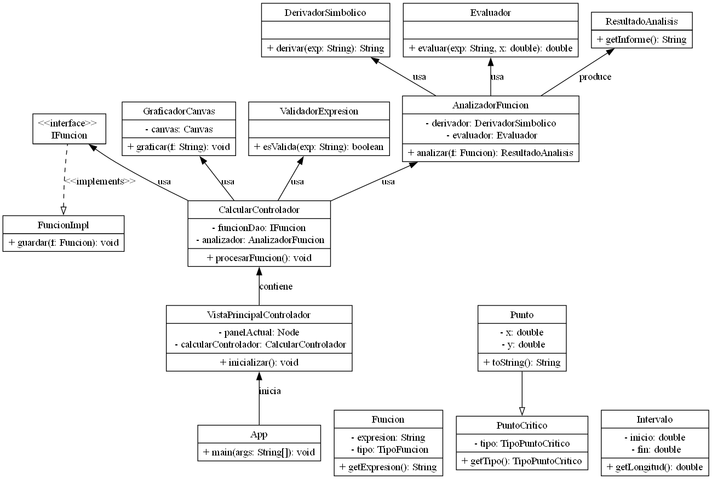
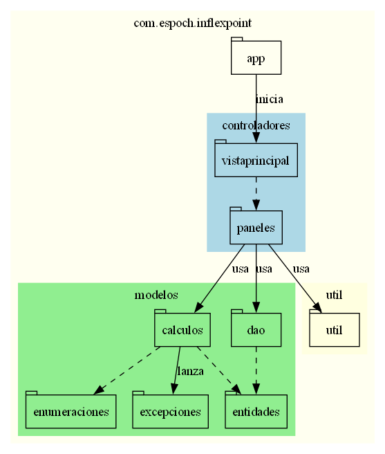
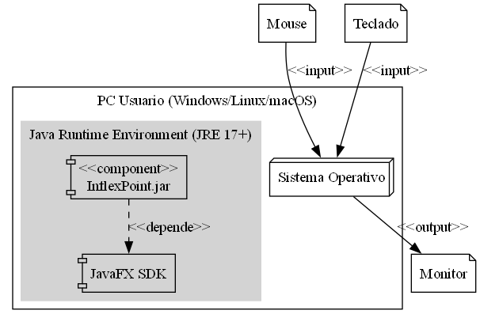

# Manual Técnico: InflexPoint

> **Versión**: 1.0.0
> **Fecha**: Enero 2026
> **Estado**: Final

## 1. Introducción Técnica

### Propósito del Sistema
El sistema **InflexPoint** es una herramienta de software diseñada para asistir a estudiantes y profesionales en el análisis exhaustivo de funciones matemáticas. Su propósito principal es automatizar el cálculo del cálculo diferencial básica (derivadas, puntos críticos, inflexión) y proporcionar una visualización interactiva que facilite la comprensión del comportamiento funcional.

### Alcance Técnico
El sistema abarca:
*   **Entrada de Datos**: Parser matemático para interpretar expresiones algebraicas (polinómicas, racionales, trigonométricas, exponenciales, logarítmicas).
*   **Motor de Cálculo**: Algoritmos simbólicos para primeras y segundas derivadas.
*   **Análisis Analítico**: Resolución de ecuaciones $f'(x)=0$ y $f''(x)=0$ mediante métodos numéricos (Newton-Raphson) o analíticos simplificados para encontrar raíces en intervalos definidos.
*   **Visualización**: Renderizado de gráficas 2D con ejes dinámicos y trazado de puntos de interés.

## 2. Requerimientos del Sistema

### Requerimientos Funcionales (RF)
*   **RF1 [Gestión de Funciones]**: El sistema debe permitir ingresar, editar y validar sintácticamente una función variable real $f(x)$.
*   **RF2 [Cálculo de Derivadas]**: El sistema debe computar y mostrar la expresión simbólica de $f'(x)$ y $f''(x)$.
*   **RF3 [Puntos Críticos]**: El sistema debe identificar máximos y mínimos locales, mostrando sus coordenadas.
*   **RF4 [Puntos de Inflexión]**: El sistema debe detectar cambios de concavidad.
*   **RF5 [Gráfica]**: El sistema debe dibujar la curva de la función y resaltar los puntos críticos e inflexión calculados.
*   **RF6 [Historial]**: El sistema debe mantener un registro temporal de las funciones analizadas en la sesión actual.

### Requerimientos No Funcionales (RNF)
*   **RNF1 [Usabilidad]**: La interfaz debe ser intuitiva, siguiendo los lineamientos de Material Design o similar adaptado a JavaFX.
*   **RNF2 [Performance]**: El tiempo de cálculo para funciones estándar no debe exceder los 2 segundos.
*   **RNF3 [Robustez]**: El sistema no debe cerrarse ante entradas matemáticas inválidas (ej. división por cero, sintaxis errónea), sino mostrar mensajes de error controlados.
*   **RNF4 [Portabilidad]**: El ejecutable (.jar) debe funcionar en cualquier sistema operativo con JRE 17 o superior.

## 3. Requerimientos Ágiles (Scrum)

El proyecto se gestionó mediante Historias de Usuario agrupadas en Épicas.

### Épica 1: Análisis Matemático Core
*   **HU001 - Ingreso de Expresiones**: *Como estudiante, quiero escribir funciones con sintaxis natural para poder analizarlas.*
    *   *Criterio de Aceptación*: Debe soportar operadores (+, -, *, /, ^) y paréntesis.
*   **HU002 - Derivación**: *Como estudiante, quiero ver la derivada analítica para verificar mis tareas.*
    *   *Criterio de Aceptación*: Mostrar $f'(x)$ simplificada.

### Épica 2: Visualización y UI
*   **HU003 - Graficación**: *Como usuario, quiero ver la gráfica de la función para entender su forma.*
    *   *Criterio de Aceptación*: Ejes coordenados, zoom/desplazamiento básico (si aplica), curva suave.
*   **HU004 - Reporte de Puntos**: *Como usuario, quiero una lista de máximos y mínimos para conocer los extremos.*

### Backlog Priorizado
1.  Parser y validación de entrada (Alta)
2.  Cálculo de derivadas (Alta)
3.  Gráfica básica (Media)
4.  Cálculo de raíces/puntos críticos (Media)
5.  Historial (Baja)
6.  Exportación (Futuro)

## 4. Arquitectura del Sistema

### Patrón: Modelo-Vista-Controlador (MVC) + DAO
Se optó por **MVC** para desacoplar la compleja lógica matemática de la interfaz gráfica.

*   **Modelo**: Encapsula el "conocimiento" del sistema. No sabe nada de la interfaz. Clases clave: `AnalizadorFuncion`, `DerivadorSimbolico`.
*   **Vista**: Es pasiva. Solo muestra datos y envía eventos al controlador. Implementada en FXML.
*   **Controlador**: Orquesta el flujo. Al hacer clic en "Calculard", el controlador invoca al Modelo, obtiene el resultado y actualiza la Vista.
*   **DAO**: Se utiliza para abstraer el almacenamiento del historial (`IFuncion`), permitiendo cambiar la fuente de datos (Memoria -> BD) sin afectar al resto del sistema.

## 5. Diagramas UML

A continuación se presentan los diagramas generados dinámicamente desde la estructura del código.

### Diagrama de Casos de Uso
Muestra las funcionalidades accesibles por el usuario.

### Diagrama de Clases
Detalla la estructura estática, atributos y métodos de las clases principales.

### Diagrama de Paquetes
Ilustra la organización modular del código fuente.

### Diagrama de Despliegue
Muestra cómo se instala y ejecuta el software en el hardware del cliente.

> **Nota**: Si las imágenes no se visualizan, asegúrese de ejecutar los scripts de generación en la carpeta `scripts/`.

## 6. Estructura del Proyecto

El código fuente se encuentra bajo `src/main/java` en el paquete `com.espoch.inflexpoint`:

*   `app`:
    *   `App.java`: Punto de entrada (Main). Carga el FXML principal.
*   `controladores`:
    *   `vistaprincipal`: Lógica de la ventana contenedor.
    *   `paneles`: Lógica específica de cada panel (Calculadora, Historial, Ayuda).
*   `modelos`:
    *   `calculos`: Motores matemáticos (`DerivadorSimbolico`, `Evaluador`).
    *   `dao`: Interfaces e implementaciones de acceso a datos.
    *   `entidades`: Objetos de dominio (`Funcion`, `Punto`).
    *   `excepciones`: Excepciones personalizadas para manejo de errores de dominio.
*   `util`:
    *   Herramientas gráficas (`GraficadorCanvas`) y validadores.

## 7. Instalación y Ejecución

### Requisitos del Entorno
*   **Sistema Operativo**: Windows 10/11, macOS, o Linux.
*   **V. Java**: JDK 17 o superior.
*   **Resolución Pantalla**: Mínimo 1024x768.

### Pasos de Ejecución
1.  **Desde IDE (NetBeans/IntelliJ)**:
    *   Abrir el proyecto como "Maven Project".
    *   Ejecutar `mvn clean install`.
    *   Ejecutar la clase `com.espoch.inflexpoint.app.App`.
2.  **Desde JAR Ejecutable**:
    *   Obtener `InflexPoint-1.0.jar`.
    *   Ejecutar comando: `java -jar InflexPoint-1.0.jar`.

## 8. Mantenimiento y Extensión

### Cómo agregar nuevas funciones matemáticas
Para soportar nuevas operaciones (ej. `tan(x)` si no existiera):
1.  Modificar `ValidadorExpresion` para aceptar el token.
2.  Actualizar `DerivadorSimbolico` agregando la regla de derivación correspondiente.
3.  Actualizar `Evaluador` para manejar el cálculo numérico.

### Dónde modificar la UI
*   Los diseños visuales están en `src/main/resources/fxml/`. Editar estos archivos con SceneBuilder.
*   Los estilos CSS están en `src/main/resources/styles/`.

### Soporte Técnico
Para reportar bugs o solicitar features, contactar al equipo de desarrollo a través del repositorio oficial.

---
*Manual Técnico generado automáticamente. Propiedad Intelectual de ESPOCH.*
